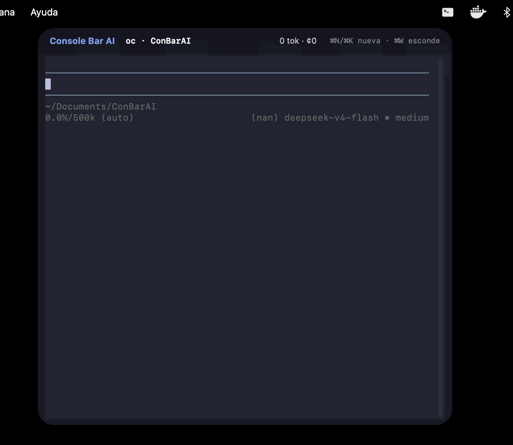
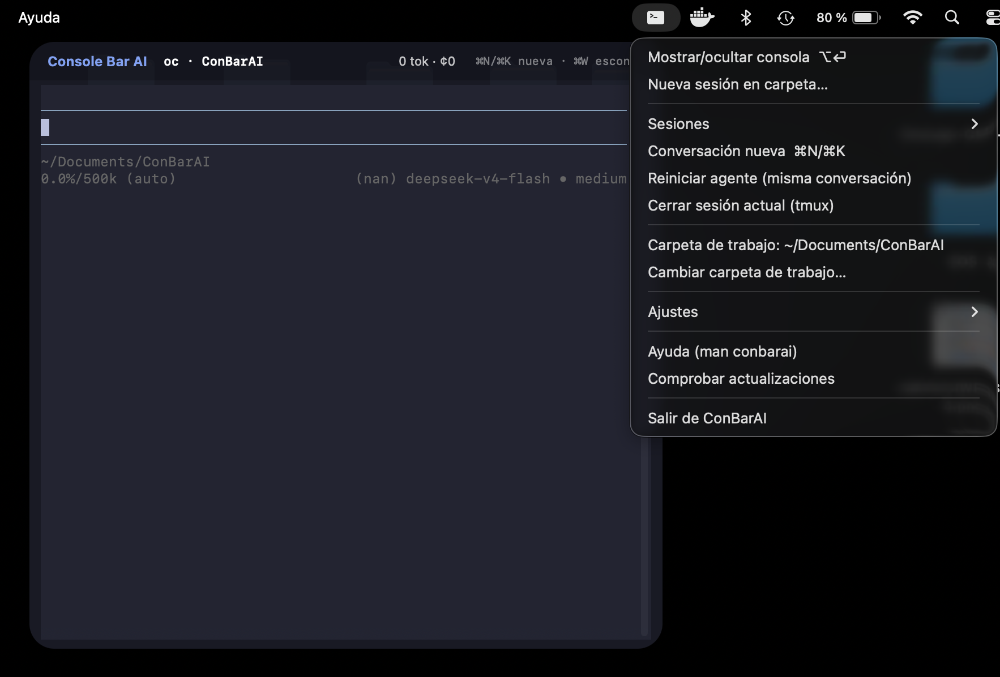
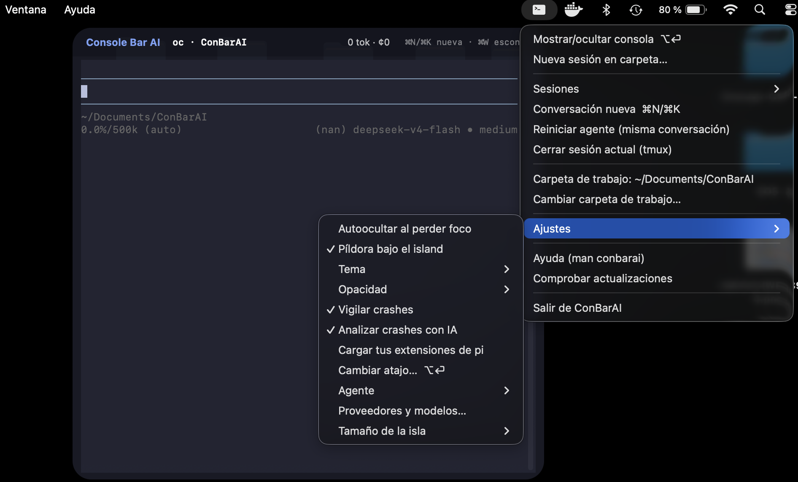
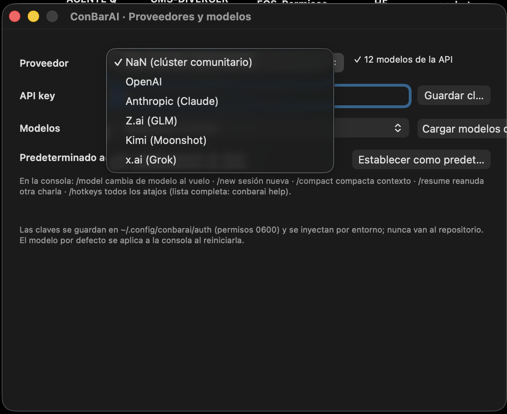

<div align="center">

# ConBarAI para macOS

**La consola con IA que se esconde debajo del island.**

Un atajo (⌥⏎) y baja del notch como una Dynamic Island; otro, y vuelve a
esconderse. Dentro vive **pi** (pi.dev), un agente ligero que responde
cualquier pregunta y controla tu Mac. Sin ventanas nuevas, sin perder el flujo.

[Capturas](#capturas) · [Instalación](#instalación) · [Atajos](#atajos) · [Seguridad](#seguridad)

`macOS 13+ · nativo para Apple silicon (M1–M4), funciona también en Intel · MIT · by 686f6c61`

</div>

---

## Capturas

| La isla abierta | Menú de la barra de menús |
|---|---|
|  |  |

| Ajustes | Proveedores y modelos |
|---|---|
|  |  |

Colapsada, ConBarAI **no se ve**: es una ventana negra exactamente del tamaño
del notch, negro sobre negro. Solo asoma un punto ámbar cuando el agente
responde con la isla escondida. Al abrirla: cabecera con sesión, uso
(tokens/coste) y atajos; terminal real (SwiftTerm + tmux) con tu conversación
donde la dejaste — sobrevive a esconderla, cerrarla o reiniciar el Mac.

## Instalación

### Opción A — DMG (recomendada)

1. Descarga el `ConBarAI-x.y.z.dmg` de [releases](https://github.com/686f6c61/ConBarAI-MacOS/releases).
2. Arrastra **ConBarAI** a **Aplicaciones**.
3. Doble clic: se auto-configura (LaunchAgents, skills, `~/.local/bin/conbarai`)
   y la píldora ya vive en tu notch. Sin Dock, sin sudo.
4. Abre Ajustes (icono  de la barra de menús) → **Proveedores y modelos**,
   pega tu API key (NaN, OpenAI, Claude, Z.ai, Kimi o x.ai), carga sus
   modelos y fija el predeterminado.

Requisitos: [pi](https://pi.dev) (`npm i -g @mariozechner/pi-coding-agent`) y
tmux (`brew install tmux`). El agente de respaldo OpenCode es opcional.

### Opción B — desde fuentes

```bash
git clone https://github.com/686f6c61/ConBarAI-MacOS
cd ConBarAI-MacOS && ./install.sh
```

Compila (Swift + SwiftTerm), registra los mismos LaunchAgents y termina
igual. `./uninstall.sh` lo retira todo.

## Qué sabe hacer

- **Consola instantánea**: ⌥⏎ o clic en el notch; pi con las skills de serie
  (`macos-operator`, `mac-gui-pilot`, `conbarai-ops`); sesión por carpeta
  (`oc` / `oc-<carpeta>`); ⌘N conversación nueva, ⌘W esconde.
- **Preguntar lo que sea y controlar el Mac**: la skill macos-operator trae
  la caja de mando (System Events, Shortcuts, defaults, Finder, red, brew,
  launchd…) con la disciplina de diagnosticar antes de cambiar y saber
  deshacer; mac-gui-pilot añade computer-use con verificación visual.
- **Proveedores y modelos**: 6 proveedores, modelos cargados en vivo desde
  sus APIs, claves en `~/.config/conbarai/auth` (0600) inyectadas por
  entorno — nunca en el repo.
- **Forense de crashes**: un LaunchAgent vigila los informes `.ips` del
  sistema; ante un fallo, un agente sin herramientas escribe un informe en
  español (Qué pasó / Evidencia / Causa probable / Arreglo / Cómo evitarlo).
- **Auto-actualización**: `conbarai update` baja el DMG del último release,
  sustituye el .app y relanza los agentes. El tray avisa solo.

## Atajos

| Atajo | Acción |
|---|---|
| ⌥⏎ / clic en el island | mostrar/ocultar la consola |
| ⌘N o ⌘K | conversación nueva (limpia; la anterior se recupera con `pi -r`) |
| ⌘W | esconder la isla |
| `/model`, `/new`, `/compact`… | comandos de pi (lista completa: `conbarai help`) |

## Seguridad

- Todo en espacio de usuario, sin sudo; permisos TCC solo si tú los concedes.
- Claves API en `~/.config/conbarai/auth` (0600) e inyección por entorno.
- El análisis de crashes corre con `pi --no-tools`: solo razona sobre
  evidencia ya recogida con una lista cerrada de comandos de solo lectura.
- Única llamada de red propia: el check de actualizaciones contra
  `api.github.com` (desactivable).
- El instalador nunca ejecuta scripts remotos.

## Actualizaciones y desinstalación

```bash
conbarai update --check   # ¿hay novedades?
conbarai update           # descargar DMG, sustituir .app y relanzar
./uninstall.sh            # retirada limpia (agentes, binario; pregunta antes de borrar datos)
```

## Más documentación

- `conbarai help` — manual integrado (atajos, comandos slash, archivos).
- [CHANGELOG.md](CHANGELOG.md) — historial de versiones.
- Es port nativo de [ubuntu-ConBarAI](https://github.com/686f6c61/ubuntu-ConBarAI);
  mismas misiones, distinta casa: NSPanel+SwiftTerm en vez de GTK, launchd en
  vez de systemd, `.ips` en vez de journald.

## Licencia

MIT — igual que la versión Ubuntu.
